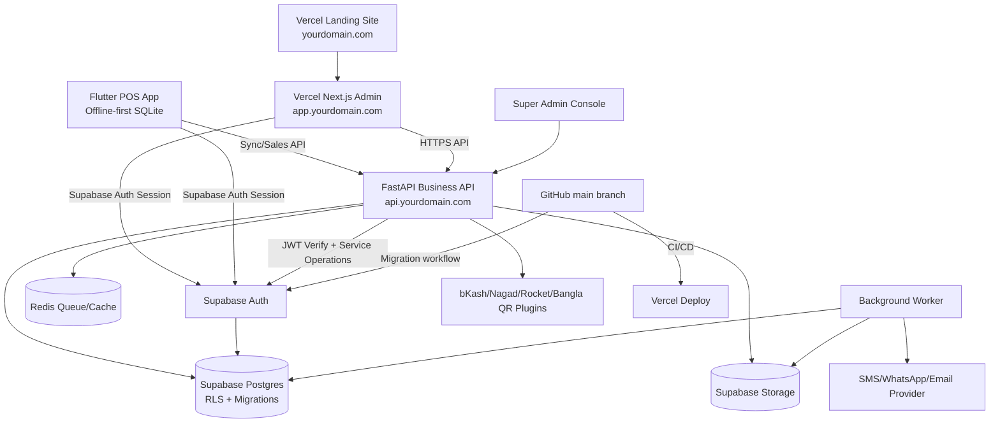

# বাংলাদেশ Retail + Wholesale Business OS — Production Supabase + Vercel Launch Architecture & Codex Master Prompt

**ডকুমেন্ট টাইপ:** Production-grade Codex-ready system architecture + Supabase/Vercel launch prompt  
**টার্গেট মার্কেট:** বাংলাদেশি খুচরা দোকান, পাইকারি ব্যবসা, শোরুম, ডিস্ট্রিবিউটর, গুদাম, ছোট-মাঝারি ব্যবসা  
**প্রোডাক্ট ভিশন:** দোকানদার/ব্যবসায়ীর জন্য production-ready POS, inventory, due/baki, purchase/supplier, wholesale, reports, admin monitoring, sourcing/outsourcing এবং offline-first business management system।  
**Final Stack Decision:** Flutter POS app + Next.js Admin/Web Dashboard on Vercel + FastAPI Business API + Supabase Auth/Postgres/RLS/Storage + Redis/Worker + GitHub CI/CD  
**মনিটাইজেশন:** Subscription ছাড়া one-time license / lifetime activation / per-device license / paid add-on module

## 0. Final Production Launch Decision — No Demo Compromise

এই architecture এখন **demo/trial scaffold নয়**। প্রথম launch থেকেই system হবে production-grade:

- **Supabase হবে core production base**: Auth, Postgres, RLS, migrations, storage, backups/export strategy।
- **GitHub হবে source of truth**: main branch protected, PR review, CI checks, migration review।
- **Vercel হবে public launch surface**: landing site + owner/admin web dashboard + custom domain।
- **FastAPI থাকবে business logic layer**: sale calculation, due ledger, stock movement, permission checks, reports, sync API।
- **No mock/demo data in production path**: production screens real Supabase/Auth/API দিয়ে wired হবে। Seed data থাকলে only local/dev/staging environment এ থাকবে।
- **No shortcut on security**: RLS, tenant isolation, RBAC, audit logs, immutable invoices, idempotent sync mandatory।
- **No partial architecture**: POS, admin monitoring, product, sales, cash memo, due, supplier, purchase, wholesale, sourcing/outsourcing সব module architecture-এ থাকবে; build হবে phased কিন্তু production foundation একই থাকবে।

Launch target:

```txt
https://yourdomain.com              -> Vercel landing/marketing site
https://app.yourdomain.com          -> Vercel owner/admin dashboard
https://api.yourdomain.com          -> FastAPI production API
Supabase project                    -> production DB/Auth/Storage/RLS
GitHub main branch                  -> deployable production source
```

---

## 1. প্রোডাক্টের মূল লক্ষ্য

এই সিস্টেমের লক্ষ্য হলো বাংলাদেশের দোকান/ব্যবসার বাস্তব সমস্যা solve করা:

- খাতা/বাকির হিসাব ডিজিটাল করা
- মাল/স্টক কত আছে, কত বিক্রি হচ্ছে, কত লাভ হচ্ছে দেখা
- নগদ, বিকাশ, নগদ, ব্যাংক, কার্ড—সব payment track করা
- retail এবং wholesale দুই ধরনের sales handle করা
- supplier purchase, sourcing, outsourcing, delivery, warehouse manage করা
- দোকান owner দূরে থাকলেও staff/cashier/sales monitor করতে পারবে
- internet না থাকলেও POS চলবে, পরে sync হবে
- invoice/cash memo/receipt print/share করা যাবে
- বাংলা ভাষা, টাকা, স্থানীয় তারিখ/ফরম্যাট, due reminder, SMS/WhatsApp style workflow support করা

---

## 2. Target User Persona

### 2.1 ছোট দোকান / মুদি / কসমেটিক / ফার্মেসি / কাপড়ের দোকান
- প্রয়োজন: সহজ বিক্রি, স্টক, বাকির হিসাব, daily profit
- ডিভাইস: Android phone/tablet
- Internet: সবসময় stable না
- প্রিন্টার: Bluetooth thermal printer / normal A4

### 2.2 পাইকারি ব্যবসা / ডিস্ট্রিবিউটর
- প্রয়োজন: customer-wise price, carton/packet/unit conversion, due ledger, sales rep, delivery challan
- Multi-branch/warehouse দরকার হতে পারে

### 2.3 শোরুম / Boutique / Electronics / Mobile shop
- প্রয়োজন: barcode, serial/IMEI, warranty, variant, return/exchange

### 2.4 Owner / Admin
- প্রয়োজন: branch-wise sales, staff performance, cash drawer, due collection, theft/loss monitoring

---

## 3. Product Scope Summary

সিস্টেমটি তিনটি প্রধান interface নিয়ে build হবে:

1. **POS App** — Flutter Android/iOS/PWA-ready app, offline-first, cashier/staff focused  
2. **Admin Web Dashboard** — Next.js dashboard, owner/manager/accountant focused  
3. **Backend API** — FastAPI + PostgreSQL, multi-tenant, secure, sync-ready  

ঐচ্ছিকভাবে পরে add করা যাবে:

4. **Customer Portal** — customer ledger/payment link/invoice view  
5. **Supplier Portal** — purchase order/status/sourcing update  
6. **Super Admin SaaS Console** — license activation, merchant monitoring, support

---

## 4. Recommended Tech Stack

### 4.1 Frontend — POS App

**Flutter** ব্যবহার করো কারণ:
- Android tablet/phone এ ভালো চলে
- Offline SQLite support সহজ
- Bluetooth thermal printer integration সম্ভব
- Future iOS/Desktop support সম্ভব

Suggested packages:
- `flutter_riverpod` — state management
- `go_router` — navigation
- `drift` অথবা `sqflite` — offline local database
- `dio` — API client
- `freezed` + `json_serializable` — typed models
- `connectivity_plus` — network status
- `esc_pos_utils_plus` / bluetooth print package — thermal printing
- `mobile_scanner` — barcode/QR scan
- `intl` — date/currency formatting

### 4.2 Frontend — Admin Dashboard

**Next.js + TypeScript** ব্যবহার করো:
- Owner/admin dashboard web থেকে সহজে ব্যবহার করবে
- Charts, tables, reports, PDF export easier
- SEO দরকার নেই, admin app হিসেবে optimized হবে

Suggested stack:
- Next.js App Router
- TypeScript
- Tailwind CSS
- shadcn/ui
- TanStack Query
- TanStack Table
- Recharts
- Zod + React Hook Form

### 4.3 Backend API

**FastAPI + PostgreSQL** ব্যবহার করো:
- তোমার existing comfort stack এর সাথে match করে
- Business logic clean রাখা যায়
- Async API + background worker support ভালো

Suggested backend stack:
- FastAPI
- SQLAlchemy 2.x / SQLModel
- Alembic migrations
- PostgreSQL
- Redis for cache/job queue/rate limit
- Celery/RQ/Arq worker
- Pydantic v2
- Pytest
- Ruff + mypy

### 4.4 Final Auth, Database & Storage Decision — Supabase Production Base

এই project এ আর “Option A/B” থাকবে না। Final production decision:

**Supabase Auth + Supabase Postgres + Supabase RLS + Supabase Storage**

ব্যবহার হবে কারণ:

- Auth, Postgres, RLS, Storage এক platform এ পাওয়া যায়
- Supabase Auth JWT দিয়ে FastAPI এবং Next.js দুই দিকেই secure session verify করা যাবে
- RLS দিয়ে browser/client leak হলেও tenant boundary protect করা যায়
- Supabase CLI migrations GitHub repo-তে version-controlled রাখা যায়
- Backup/export/admin work সহজ হয়

Production rule:

- Supabase `service_role` key কখনো frontend/Flutter/Vercel client bundle এ যাবে না।
- Browser/Flutter only `anon`/publishable key use করবে, RLS enforced থাকবে।
- FastAPI server-side service operations only secure backend environment থেকে হবে।
- সব business table-এ RLS enabled থাকবে। Supabase docs অনুযায়ী exposed schema, especially `public`, এ RLS always enable করতে হবে।

### 4.5 Storage

Primary storage:

- Supabase Storage — product images, business logos, invoice PDFs, receipt images, import/export files।

Optional later:

- Cloudflare R2 — যদি high-volume invoice/product media cost optimize করতে হয়।

Storage rules:

- Private buckets by default।
- Public product/media access হলে signed URL অথবা strict public path policy।
- Invoice/customer statement private থাকবে।
- File metadata DB table-এ organization_id সহ store হবে।

### 4.6 Deployment & Domain Architecture

Production launch হবে GitHub + Vercel + Supabase based:

| Layer | Production Choice | Notes |
|---|---|---|
| Landing site | Vercel | `yourdomain.com` |
| Admin web dashboard | Vercel Next.js | `app.yourdomain.com` |
| API | FastAPI container host / Vercel Python only if suitable | recommended: Docker host for long-running API, worker, Redis |
| Database/Auth/Storage | Supabase | production project + RLS + migrations |
| Domain/DNS | Vercel Domains or external DNS pointed to Vercel/API | Vercel custom domains support production domains |
| CI/CD | GitHub Actions + Vercel Git integration | main branch deploys production |
| Worker/Queue | Redis + worker service | reports, exports, reminders, heavy sync jobs |
| Monitoring | Sentry + uptime check + structured logs | production errors visible |

Important deployment decision:

- Vercel is best for **Next.js dashboard + landing**.
- FastAPI with Redis/worker is better as a **Docker service** on Fly.io/Render/Railway/DigitalOcean if background jobs and long-running sync are needed.
- Domain can still be under one brand: `app.yourdomain.com` on Vercel and `api.yourdomain.com` pointed to API host.
- Vercel environment variables must be configured per environment; production variables apply to production deployments, preview variables to preview deployments, and changes apply only to new deployments.

---

## 5. High-Level Architecture



### 5.1 Offline-first principle

POS app কখনো internet dependency ধরে build করা যাবে না। Cashier যেন internet off থাকলেও:

- Product search করতে পারে
- Sale করতে পারে
- Receipt print করতে পারে
- Due entry করতে পারে
- Return করতে পারে
- Cash drawer close করতে পারে

Internet আসলে local change server এ sync হবে।

---

## 6. Monorepo Structure

```txt
bd-business-os/
  apps/
    api/                         # FastAPI backend
      app/
        main.py
        core/
          config.py
          security.py
          tenant.py
          permissions.py
          errors.py
        db/
          session.py
          base.py
          migrations/
        modules/
          auth/
          organizations/
          branches/
          users/
          products/
          inventory/
          sales/
          payments/
          dues/
          customers/
          suppliers/
          purchases/
          sourcing/
          expenses/
          reports/
          licenses/
          notifications/
          sync/
          audit/
        workers/
        tests/
      pyproject.toml
      Dockerfile

    pos_flutter/                  # Flutter POS app
      lib/
        main.dart
        app/
          router.dart
          theme.dart
        core/
          api/
          db/
          sync/
          auth/
          printer/
          scanner/
          localization/
        features/
          auth/
          dashboard/
          pos/
          products/
          inventory/
          customers/
          dues/
          sales/
          returns/
          expenses/
          reports/
          settings/
        shared/
          widgets/
          models/
          utils/
      test/
      pubspec.yaml

    web_admin/                    # Next.js owner/admin dashboard
      app/
      components/
      features/
        auth/
        dashboard/
        products/
        inventory/
        sales/
        customers/
        dues/
        suppliers/
        purchases/
        sourcing/
        reports/
        staff/
        settings/
        licenses/
      lib/
        api.ts
        auth.ts
        permissions.ts
      package.json

    worker/                       # optional separate worker service

  packages/
    shared-schema/                # OpenAPI types / generated clients
    design-tokens/                # colors, typography, spacing

  infra/
    docker-compose.yml
    nginx/
    terraform-or-scripts/

  docs/
    SYSTEM_ARCHITECTURE.md
    API_CONTRACT.md
    DATABASE_SCHEMA.md
    OFFLINE_SYNC.md
    SECURITY.md
    PRD.md
    CODEX_PROMPTS.md

  .github/
    workflows/
      api-tests.yml
      web-tests.yml
      flutter-tests.yml

  README.md
```

---

## 7. Core Business Modules — Full Feature Checklist

### 7.1 Organization / Business Setup

- [ ] Business name
- [ ] Logo
- [ ] Owner name/contact
- [ ] BIN/TIN/Trade License field
- [ ] Business type: retail, wholesale, mixed, pharmacy, fashion, electronics, grocery, distributor
- [ ] Currency: BDT / ৳
- [ ] Language: Bangla + English
- [ ] Fiscal year setting
- [ ] VAT mode: no VAT, VAT inclusive, VAT exclusive, custom VAT rate
- [ ] Invoice prefix and numbering rule
- [ ] Receipt footer text
- [ ] Return policy text
- [ ] Default payment methods
- [ ] Default low-stock threshold
- [ ] Backup/export settings

### 7.2 Branch / Warehouse / Register

- [ ] Multi-branch support
- [ ] Multi-warehouse support
- [ ] Register/counter setup
- [ ] Cash drawer open/close
- [ ] Shift start/end
- [ ] Opening cash
- [ ] Cash in/out adjustment
- [ ] Closing cash expected vs actual
- [ ] Short/over cash report
- [ ] Branch transfer
- [ ] Warehouse transfer

### 7.3 User / Staff / Permission

Roles:

- [ ] Super Admin
- [ ] Business Owner
- [ ] Branch Manager
- [ ] Cashier
- [ ] Sales Rep
- [ ] Inventory Manager
- [ ] Accountant
- [ ] Purchase Manager
- [ ] Read-only Auditor
- [ ] Support Agent

Permission examples:

- [ ] Can sell
- [ ] Can discount
- [ ] Can refund
- [ ] Can edit product
- [ ] Can delete product
- [ ] Can view profit
- [ ] Can view due list
- [ ] Can collect due
- [ ] Can edit past sale
- [ ] Can close shift
- [ ] Can export data
- [ ] Can manage staff

### 7.4 Product Catalog

- [ ] Product name Bangla/English
- [ ] SKU auto/manual
- [ ] Barcode
- [ ] Category/subcategory
- [ ] Brand
- [ ] Unit: pcs, kg, gm, litre, ml, dozen, packet, carton, box, yard, meter
- [ ] Unit conversion: carton → packet → piece
- [ ] Variant: size, color, style, weight
- [ ] Product image
- [ ] Purchase price
- [ ] Retail price
- [ ] Wholesale price
- [ ] Dealer price
- [ ] Minimum selling price
- [ ] MRP
- [ ] VAT/tax category
- [ ] Discount allowed/not allowed
- [ ] Track stock yes/no
- [ ] Serial/IMEI tracking
- [ ] Batch/expiry tracking
- [ ] Warranty duration
- [ ] Reorder level
- [ ] Supplier mapping
- [ ] Active/inactive/archive

### 7.5 Inventory Management

- [ ] Current stock by branch/warehouse
- [ ] Stock ledger
- [ ] Stock adjustment
- [ ] Damage/loss/wastage
- [ ] Opening stock import
- [ ] Low-stock alert
- [ ] Out-of-stock alert
- [ ] Batch/expiry alert
- [ ] Stock transfer
- [ ] Stock count / physical inventory
- [ ] Stock reconciliation
- [ ] Inventory valuation
- [ ] FIFO/average cost support
- [ ] Product movement history

### 7.6 POS Sales

- [ ] Fast product search
- [ ] Barcode scan
- [ ] Cart
- [ ] Quantity edit
- [ ] Unit selection
- [ ] Price override with permission
- [ ] Line discount
- [ ] Invoice discount
- [ ] VAT calculation
- [ ] Hold cart
- [ ] Resume held cart
- [ ] Customer select/create during sale
- [ ] Retail/wholesale mode switch
- [ ] Multiple payment split
- [ ] Cash payment
- [ ] bKash/Nagad/Rocket/manual MFS payment
- [ ] Card/bank payment
- [ ] Due sale / partial paid sale
- [ ] Return/exchange
- [ ] Receipt print
- [ ] Share invoice PDF/image via WhatsApp/Messenger
- [ ] Offline sale queue

### 7.7 Cash Memo / Invoice / Receipt

- [ ] Thermal receipt format
- [ ] A4 invoice format
- [ ] Cash memo format
- [ ] Delivery challan
- [ ] Quotation/proforma invoice
- [ ] Purchase invoice
- [ ] Return invoice
- [ ] Due collection receipt
- [ ] QR code on invoice
- [ ] Business logo
- [ ] Customer info
- [ ] Salesperson/cashier name
- [ ] VAT/BIN/TIN field if enabled
- [ ] Terms/footer
- [ ] Duplicate/reprint tracking
- [ ] PDF export
- [ ] Image share

### 7.8 Customer Management

- [ ] Customer name
- [ ] Phone
- [ ] Address
- [ ] Area/district
- [ ] Customer type: retail, wholesale, dealer, VIP
- [ ] Opening due
- [ ] Credit limit
- [ ] Price group
- [ ] Birthday/notes
- [ ] Sales history
- [ ] Payment history
- [ ] Due ledger
- [ ] Statement export
- [ ] Customer tags
- [ ] Customer status active/blocked

### 7.9 Due / Baki / Ledger

- [ ] Customer-wise due balance
- [ ] Sale-wise due
- [ ] Partial payment
- [ ] Due collection
- [ ] Due adjustment
- [ ] Bad debt/write-off
- [ ] Due reminder
- [ ] Overdue list
- [ ] Credit limit alert
- [ ] Customer statement
- [ ] Staff-wise due collection
- [ ] Owner approval for due over limit
- [ ] Ledger print/share

### 7.10 Wholesale / Distribution

- [ ] Wholesale customer pricing
- [ ] Minimum order quantity
- [ ] Carton/packet/piece conversion
- [ ] Area-wise customer list
- [ ] Sales rep assignment
- [ ] Order booking
- [ ] Delivery challan
- [ ] Vehicle/delivery status
- [ ] Dealer commission
- [ ] Route plan optional
- [ ] Customer credit limit
- [ ] Bulk invoice

### 7.11 Supplier Management

- [ ] Supplier name/company
- [ ] Contact person
- [ ] Phone/email/address
- [ ] Opening payable
- [ ] Supplier product list
- [ ] Purchase history
- [ ] Payment history
- [ ] Payable ledger
- [ ] Supplier rating
- [ ] Delivery lead time

### 7.12 Purchase Management

- [ ] Purchase order
- [ ] Goods received note
- [ ] Purchase invoice
- [ ] Purchase return
- [ ] Supplier payment
- [ ] Partial payment
- [ ] Supplier due/payable
- [ ] Landed cost
- [ ] Transport cost
- [ ] Loading/unloading cost
- [ ] Purchase price update rule
- [ ] Stock auto increment after receiving
- [ ] Approval workflow

### 7.13 Sourcing / Outsourcing Module

বাংলাদেশের অনেক ব্যবসায় মাল বাইরে থেকে source করে, কারখানা/কারিগর/third-party দিয়ে বানায় বা অন্য জায়গা থেকে এনে sell করে। এজন্য আলাদা module থাকবে।

- [ ] Sourcing request
- [ ] Required item/specification
- [ ] Target purchase price
- [ ] Target delivery date
- [ ] Assigned sourcing agent
- [ ] Potential supplier list
- [ ] Quote collection
- [ ] Quote comparison
- [ ] Sample status
- [ ] Approval/rejection
- [ ] Outsourced production order
- [ ] Factory/vendor assignment
- [ ] Advance payment
- [ ] Production status
- [ ] Quality check
- [ ] Receiving into inventory
- [ ] Cost calculation
- [ ] Profitability after sourcing cost

### 7.14 Expense / Cashbook / Accounts Lite

- [ ] Daily expense entry
- [ ] Expense category
- [ ] Staff salary
- [ ] Rent
- [ ] Utility
- [ ] Transport
- [ ] Packaging
- [ ] Marketing
- [ ] Repair
- [ ] Owner withdrawal
- [ ] Cash in/out
- [ ] Bank/MFS account ledger
- [ ] Profit/loss lite
- [ ] Cashbook report

### 7.15 Payment Methods & MFS

Phase 1 এ manual payment tracking থাকবে। Phase 2/3 এ API integration optional।

- [ ] Cash
- [ ] bKash manual trx id
- [ ] Nagad manual trx id
- [ ] Rocket manual trx id
- [ ] Bank transfer
- [ ] Card
- [ ] Cheque
- [ ] Split payment
- [ ] Refund payment
- [ ] Payment reconciliation
- [ ] QR code display optional
- [ ] Gateway plugin architecture

### 7.16 Reports / Analytics

Dashboard:

- [ ] Today sales
- [ ] Today profit
- [ ] Today due sales
- [ ] Today due collection
- [ ] Cash in hand
- [ ] Stock value
- [ ] Low stock count
- [ ] Top products
- [ ] Top customers
- [ ] Branch comparison

Reports:

- [ ] Sales report
- [ ] Profit report
- [ ] Product-wise sales
- [ ] Category-wise sales
- [ ] Staff-wise sales
- [ ] Customer due report
- [ ] Supplier payable report
- [ ] Purchase report
- [ ] Expense report
- [ ] Inventory valuation
- [ ] Stock movement
- [ ] Cash drawer report
- [ ] Return report
- [ ] Discount report
- [ ] VAT/tax report optional
- [ ] Export CSV/PDF

### 7.17 Admin Monitoring / Owner Control

- [ ] Live sales feed
- [ ] Staff activity log
- [ ] Price override log
- [ ] Discount approval log
- [ ] Refund/return approval log
- [ ] Deleted/edited invoice log
- [ ] Cash drawer mismatch alert
- [ ] Due over-limit alert
- [ ] Low-stock alert
- [ ] Suspicious discount alert
- [ ] Device login history
- [ ] Remote branch summary

### 7.18 Notification System

- [ ] In-app notification
- [ ] Low stock
- [ ] Overdue customer
- [ ] Supplier payment due
- [ ] License expiry/warning if per-device license
- [ ] Backup success/failure
- [ ] Shift closing reminder
- [ ] Optional SMS/WhatsApp integration

### 7.19 Localization for Bangladesh

- [ ] Bangla/English language switch
- [ ] ৳ currency format
- [ ] Local phone validation: +880 / 01XXXXXXXXX
- [ ] District/upazila optional fields
- [ ] Bangla invoice labels
- [ ] English invoice labels
- [ ] Local payment methods
- [ ] Due/baki terminology
- [ ] Thermal printer support common in BD shops

### 7.20 Backup / Import / Export

- [ ] Product import CSV/Excel
- [ ] Customer import CSV/Excel
- [ ] Opening stock import
- [ ] Sales export
- [ ] Customer statement export
- [ ] Full backup export
- [ ] Automated cloud backup
- [ ] Offline local backup
- [ ] Restore flow with admin permission

### 7.21 License / Monetization Without Subscription

Subscription ছাড়া monetization model:

- [ ] Internal beta access without fake demo flow
- [ ] One-time lifetime license
- [ ] Per-device license
- [ ] Per-branch license
- [ ] Paid add-on modules
- [ ] Offline activation key
- [ ] Online activation check
- [ ] Device fingerprint
- [ ] License transfer request
- [ ] Grace period
- [ ] Super admin license console

Suggested pricing model:

1. **Starter Lifetime** — single shop, one device, core POS + due + inventory  
2. **Business Lifetime** — multi-device, reports, purchase, expense  
3. **Wholesale Pro Add-on** — wholesale, sales rep, delivery challan  
4. **Sourcing Add-on** — sourcing/outsourcing module  
5. **Multi-Branch Add-on** — multiple branches/warehouses  
6. **Support/Setup Service** — one-time paid setup/training/import service

---

## 8. Database Architecture

### 8.1 Multi-tenant Rule

প্রতিটি business একটি `organization`। সব critical table এ `organization_id` থাকবে। Branch-level data এ `branch_id` থাকবে।

Golden rule:

```txt
কোনো API কখনো organization_id ছাড়া business data read/write করবে না।
```

### 8.2 Core Tables

```txt
organizations
  id uuid pk
  name text
  slug text unique
  business_type text
  logo_url text
  phone text
  address text
  tin text nullable
  bin text nullable
  trade_license text nullable
  currency text default 'BDT'
  language text default 'bn'
  timezone text default 'Asia/Dhaka'
  settings jsonb
  created_at timestamptz

branches
  id uuid pk
  organization_id uuid fk
  name text
  address text
  phone text
  is_main boolean
  created_at timestamptz

warehouses
  id uuid pk
  organization_id uuid fk
  branch_id uuid nullable
  name text
  address text

users
  id uuid pk
  auth_user_id uuid unique
  name text
  phone text
  email text nullable
  status text
  created_at timestamptz

memberships
  id uuid pk
  organization_id uuid fk
  user_id uuid fk
  role text
  branch_id uuid nullable
  permissions jsonb
  status text

licenses
  id uuid pk
  organization_id uuid fk
  plan_code text
  license_key text unique
  license_type text
  max_branches int
  max_devices int
  modules jsonb
  activated_at timestamptz
  expires_at timestamptz nullable
  status text

devices
  id uuid pk
  organization_id uuid fk
  branch_id uuid nullable
  device_fingerprint text
  device_name text
  platform text
  last_seen_at timestamptz
  status text
```

### 8.3 Product & Inventory Tables

```txt
categories
  id uuid pk
  organization_id uuid fk
  parent_id uuid nullable
  name text
  sort_order int

brands
  id uuid pk
  organization_id uuid fk
  name text

units
  id uuid pk
  organization_id uuid fk
  name text
  symbol text

products
  id uuid pk
  organization_id uuid fk
  category_id uuid nullable
  brand_id uuid nullable
  name text
  name_bn text nullable
  sku text
  barcode text nullable
  product_type text
  track_stock boolean
  track_serial boolean
  track_batch boolean
  vat_rate numeric default 0
  image_url text nullable
  status text
  created_at timestamptz

product_variants
  id uuid pk
  organization_id uuid fk
  product_id uuid fk
  variant_name text
  sku text
  barcode text nullable
  attributes jsonb
  purchase_price numeric
  retail_price numeric
  wholesale_price numeric
  dealer_price numeric nullable
  min_selling_price numeric nullable
  reorder_level numeric default 0
  status text

inventory_balances
  id uuid pk
  organization_id uuid fk
  branch_id uuid fk
  warehouse_id uuid nullable
  product_variant_id uuid fk
  quantity numeric
  avg_cost numeric
  updated_at timestamptz

stock_movements
  id uuid pk
  organization_id uuid fk
  branch_id uuid fk
  warehouse_id uuid nullable
  product_variant_id uuid fk
  movement_type text
  quantity_change numeric
  unit_cost numeric nullable
  reference_type text
  reference_id uuid nullable
  note text nullable
  created_by uuid
  created_at timestamptz

serial_numbers
  id uuid pk
  organization_id uuid fk
  product_variant_id uuid fk
  serial text
  imei text nullable
  status text
  current_branch_id uuid nullable
  current_sale_id uuid nullable

batches
  id uuid pk
  organization_id uuid fk
  product_variant_id uuid fk
  batch_no text
  expiry_date date nullable
  quantity numeric
```

### 8.4 Sales / POS Tables

```txt
customers
  id uuid pk
  organization_id uuid fk
  name text
  phone text nullable
  address text nullable
  customer_type text
  price_group text nullable
  credit_limit numeric default 0
  opening_due numeric default 0
  status text
  created_at timestamptz

sales
  id uuid pk
  organization_id uuid fk
  branch_id uuid fk
  register_id uuid nullable
  customer_id uuid nullable
  invoice_no text
  sale_type text          # retail/wholesale
  status text             # draft/held/completed/returned/void
  subtotal numeric
  discount_total numeric
  vat_total numeric
  grand_total numeric
  paid_total numeric
  due_total numeric
  profit_total numeric
  cashier_id uuid
  sold_at timestamptz
  synced_from_device_id uuid nullable
  offline_id text nullable

sale_items
  id uuid pk
  organization_id uuid fk
  sale_id uuid fk
  product_variant_id uuid fk
  description text
  quantity numeric
  unit_id uuid nullable
  unit_price numeric
  purchase_cost numeric
  discount numeric
  vat_rate numeric
  line_total numeric
  serials jsonb nullable
  batch_id uuid nullable

payments
  id uuid pk
  organization_id uuid fk
  branch_id uuid fk
  payment_type text       # sale_payment/due_collection/supplier_payment/refund
  method text             # cash/bkash/nagad/rocket/card/bank/cheque
  amount numeric
  reference_no text nullable
  sale_id uuid nullable
  customer_id uuid nullable
  supplier_id uuid nullable
  paid_at timestamptz
  received_by uuid

customer_ledger_entries
  id uuid pk
  organization_id uuid fk
  customer_id uuid fk
  entry_type text         # sale_due/payment/adjustment/writeoff/opening
  debit numeric
  credit numeric
  balance_after numeric
  reference_type text
  reference_id uuid nullable
  note text nullable
  created_at timestamptz
```

### 8.5 Purchase / Supplier Tables

```txt
suppliers
  id uuid pk
  organization_id uuid fk
  name text
  phone text nullable
  address text nullable
  opening_payable numeric default 0
  status text

purchase_orders
  id uuid pk
  organization_id uuid fk
  branch_id uuid fk
  supplier_id uuid fk
  po_no text
  status text
  expected_date date nullable
  subtotal numeric
  discount_total numeric
  expense_total numeric
  grand_total numeric
  paid_total numeric
  payable_total numeric
  created_by uuid
  created_at timestamptz

purchase_items
  id uuid pk
  organization_id uuid fk
  purchase_order_id uuid fk
  product_variant_id uuid fk
  quantity numeric
  unit_cost numeric
  line_total numeric

supplier_ledger_entries
  id uuid pk
  organization_id uuid fk
  supplier_id uuid fk
  entry_type text
  debit numeric
  credit numeric
  balance_after numeric
  reference_type text
  reference_id uuid nullable
  created_at timestamptz
```

### 8.6 Sourcing Tables

```txt
sourcing_requests
  id uuid pk
  organization_id uuid fk
  title text
  description text
  requested_by uuid
  assigned_to uuid nullable
  target_cost numeric nullable
  target_date date nullable
  status text
  created_at timestamptz

sourcing_quotes
  id uuid pk
  organization_id uuid fk
  sourcing_request_id uuid fk
  supplier_id uuid nullable
  vendor_name text nullable
  quoted_price numeric
  min_quantity numeric nullable
  delivery_days int nullable
  notes text nullable
  status text

outsourcing_orders
  id uuid pk
  organization_id uuid fk
  sourcing_request_id uuid fk
  supplier_id uuid nullable
  order_no text
  status text
  advance_paid numeric default 0
  expected_date date nullable
  quality_status text nullable
```

### 8.7 Audit & Sync Tables

```txt
audit_logs
  id uuid pk
  organization_id uuid fk
  actor_user_id uuid nullable
  action text
  entity_type text
  entity_id uuid nullable
  old_value jsonb nullable
  new_value jsonb nullable
  ip_address text nullable
  device_id uuid nullable
  created_at timestamptz

sync_events
  id uuid pk
  organization_id uuid fk
  device_id uuid fk
  client_event_id text
  entity_type text
  entity_id uuid
  operation text
  payload jsonb
  server_version bigint
  status text
  created_at timestamptz

outbox_events
  id uuid pk
  organization_id uuid fk
  event_type text
  payload jsonb
  status text
  attempts int default 0
  created_at timestamptz
```

---

## 9. API Architecture

Base path:

```txt
/api/v1
```

### 9.1 Auth & Organization

```txt
POST   /auth/login
POST   /auth/register-business
POST   /auth/refresh
GET    /me
GET    /organizations/current
PATCH  /organizations/current
GET    /branches
POST   /branches
PATCH  /branches/{id}
```

### 9.2 Product & Inventory

```txt
GET    /products
POST   /products
GET    /products/{id}
PATCH  /products/{id}
DELETE /products/{id}
POST   /products/import
GET    /categories
POST   /categories
GET    /inventory/balances
POST   /inventory/adjustments
POST   /inventory/transfers
GET    /inventory/movements
GET    /inventory/low-stock
```

### 9.3 POS / Sales

```txt
POST   /sales
GET    /sales
GET    /sales/{id}
POST   /sales/{id}/void
POST   /sales/{id}/return
POST   /sales/held
GET    /sales/held
POST   /payments
GET    /receipts/{sale_id}/pdf
```

### 9.4 Customers / Due

```txt
GET    /customers
POST   /customers
GET    /customers/{id}
PATCH  /customers/{id}
GET    /customers/{id}/ledger
POST   /customers/{id}/payments
GET    /dues
GET    /dues/overdue
GET    /customers/{id}/statement.pdf
```

### 9.5 Suppliers / Purchase

```txt
GET    /suppliers
POST   /suppliers
GET    /suppliers/{id}/ledger
POST   /purchase-orders
GET    /purchase-orders
GET    /purchase-orders/{id}
POST   /purchase-orders/{id}/receive
POST   /suppliers/{id}/payments
```

### 9.6 Sourcing

```txt
GET    /sourcing/requests
POST   /sourcing/requests
PATCH  /sourcing/requests/{id}
POST   /sourcing/requests/{id}/quotes
POST   /outsourcing/orders
PATCH  /outsourcing/orders/{id}
```

### 9.7 Reports

```txt
GET    /reports/dashboard
GET    /reports/sales
GET    /reports/profit
GET    /reports/inventory
GET    /reports/customer-dues
GET    /reports/supplier-payables
GET    /reports/expenses
GET    /reports/cash-drawer
```

### 9.8 Offline Sync

```txt
POST   /sync/pull
POST   /sync/push
GET    /sync/bootstrap
POST   /devices/register
POST   /devices/heartbeat
```

---

## 10. Offline Sync Design

### 10.1 Local-first POS data

Flutter POS app local SQLite এ রাখবে:

- products
- product_variants
- categories
- customers
- inventory snapshot
- held carts
- sales
- sale_items
- payments
- customer ledger pending entries
- sync_outbox
- sync_state

### 10.2 Sync rules

- প্রতিটি local mutation আগে local DB তে save হবে
- তারপর `sync_outbox` এ event যাবে
- internet থাকলে background sync push করবে
- server event accept করে canonical ID/version দিবে
- conflict হলে server deterministic rule apply করবে

### 10.3 Conflict handling

Product edit conflict:
- server latest wins, but audit log রাখবে

Sale conflict:
- sale immutable after completion
- duplicate sale ঠেকাতে `client_event_id` unique

Inventory conflict:
- inventory balance direct overwrite না করে stock movement ledger থেকে calculate
- offline sale sync হলে stock movement create হবে
- negative stock policy organization setting দ্বারা controlled

Customer due conflict:
- ledger append-only
- due balance computed from ledger

### 10.4 Sync payload example

```json
{
  "device_id": "device-uuid",
  "last_server_version": 1203,
  "events": [
    {
      "client_event_id": "android-001-1700000000-sale-1",
      "entity_type": "sale",
      "operation": "create",
      "payload": { "invoice_no": "INV-0001", "items": [] }
    }
  ]
}
```

---

## 11. Security Architecture

### 11.1 Must-have Security Rules

- [ ] JWT auth
- [ ] Organization/tenant isolation
- [ ] Role-based access control
- [ ] Permission checks per endpoint
- [ ] Server-side validation for prices/discount/refund
- [ ] Audit log for sensitive actions
- [ ] Rate limit login/API
- [ ] Password hashing if custom auth
- [ ] Sensitive config in environment variables
- [ ] No cross-tenant query without organization_id
- [ ] Soft delete for business entities
- [ ] Immutable completed sales except authorized return/void

### 11.2 Sensitive Actions That Need Audit

- Product delete
- Price change
- Discount override
- Sale void
- Sale return
- Due adjustment
- Bad debt write-off
- Cash drawer close mismatch
- Supplier payment
- License activation/deactivation
- Staff permission change
- Data export

---

## 12. UI / UX Architecture

### 12.1 POS App Navigation

Bottom tabs:

1. Dashboard
2. Sell/POS
3. Products
4. Customers/Due
5. More

### 12.2 POS Screens

- Login / Business select
- Device activation
- Sync bootstrap/loading
- Today dashboard
- POS cart
- Product search/scanner
- Customer select/create
- Payment screen
- Receipt preview/print/share
- Held sales
- Sales history
- Return/exchange
- Due list
- Due collection
- Product list
- Stock adjustment
- Expense entry
- Shift open/close
- Settings

### 12.3 Admin Web Screens

- Owner dashboard
- Branch dashboard
- Sales report
- Inventory report
- Product management
- Customer & due ledger
- Supplier & purchase
- Sourcing/outsourcing
- Staff & permission
- Cash drawer reports
- Expense/cashbook
- Invoice templates
- Import/export
- License/device management
- Settings

### 12.4 Design Direction

- Clean premium but practical
- Bangla labels readable
- Big POS buttons
- Fast cart interactions
- Low-end Android compatible
- Offline status clearly visible
- Due warning visible but non-confusing
- Owner dashboard should show profit, due, cash mismatch clearly

---

## 13. Bangladesh Compliance & Practical Notes

> এই অংশ production release এর আগে local accountant/NBR-aware consultant দিয়ে verify করতে হবে। Software architecture flexible রাখা হবে যেন VAT/tax/invoice rule পরিবর্তন হলে update করা যায়।

- Standard VAT mode configurable রাখো
- VAT inclusive/exclusive দুটো support করো
- BIN/TIN/trade license fields optional রাখো
- Invoice numbering immutable রাখো
- Sales delete না করে void/return করো
- Audit trail রাখো
- Exportable reports রাখো
- Cash memo/PDF printable রাখো
- Payment method-wise report রাখো
- bKash/Nagad/Rocket manual trx ID field রাখো
- Bangla QR/gateway integration plugin হিসেবে রাখো, core dependency হিসেবে নয়

---

## 14. Monetization Architecture — Subscription ছাড়া

### 14.1 License Model

Subscription না দিলেও license architecture production-grade হবে। Trial/demo dependency থাকবে না। Core monetization:

```txt
license_key + organization_id + branch_limit + device_limit + enabled_modules + activation_status
```

### 14.2 License Types

- Internal Beta / Early Access — real production data allowed only for approved merchants
- Starter Lifetime — single shop, core POS + inventory + due
- Business Lifetime — multi-device, purchase, reports, expenses
- Wholesale Pro Add-on — dealer pricing, delivery challan, sales rep workflow
- Multi-Branch Add-on — branches, warehouses, transfers
- Sourcing Add-on — product sourcing/outsourcing request/quote/order workflow
- Support/Setup package — paid data import, training, printer setup, business onboarding

### 14.3 License Enforcement

- App start এ license + organization activation check
- Device registration + device count limit
- Branch count limit
- Module access control middleware/helper
- Offline grace period only for already-activated devices
- Activation/deactivation log
- Super admin override with audit log
- No “fake demo business” inside production environment

### 14.4 Super Admin Console

- Merchant list
- Organization health
- License create/edit/revoke
- Device reset
- Payment record manual entry
- Support notes
- Usage health: last sync, active devices, error logs
- Early access onboarding status
- Supabase project health checklist
- Domain/deployment status checklist

---
## 15. Production Development Phases for Codex

Build phased হবে, কিন্তু **foundation production হবে**। কোনো phase-এ demo/mock shortcut allowed না। UI simple হতে পারে, কিন্তু real auth/API/database/RLS দিয়ে wired হবে।

### Phase 0 — Production Repo + Supabase + Vercel Foundation

Goal: GitHub-ready monorepo, Supabase production schema baseline, Vercel deployment config, FastAPI API skeleton, Next.js dashboard skeleton, Flutter POS skeleton।

Acceptance criteria:

- [ ] Monorepo created with clean apps/api, apps/web_admin, apps/pos_flutter, supabase, docs, infra
- [ ] Supabase CLI initialized
- [ ] Production Supabase project linked through env/CLI instructions, not hardcoded
- [ ] SQL migrations created for core tenant/auth/business tables
- [ ] RLS enabled on every exposed business table
- [ ] Tenant policies added for organization/member access
- [ ] FastAPI app runs with Supabase JWT verification
- [ ] `/api/v1/health` and `/api/v1/auth/me` implemented
- [ ] Next.js dashboard connects to Supabase Auth and FastAPI client structure
- [ ] Flutter app connects to real environment config structure, no fake production data
- [ ] Vercel config added for web dashboard/landing deployment
- [ ] `.env.example` created; real secrets excluded
- [ ] GitHub Actions run API tests, migration lint/check, web build
- [ ] Docs include Supabase setup, Vercel domain setup, production deployment checklist

### Phase 1 — Auth, Organization, Branch, Staff, Device

- [ ] Supabase Auth login/register
- [ ] Owner creates organization
- [ ] Branch setup
- [ ] Staff invitation/membership
- [ ] Role/permission matrix
- [ ] Device registration
- [ ] Audit logs for org/staff/device actions
- [ ] RLS tests for cross-organization isolation

### Phase 2 — Product Catalog & Inventory Foundation

- [ ] Category/brand/unit
- [ ] Product
- [ ] Variant/SKU/barcode
- [ ] Opening stock
- [ ] Stock balance
- [ ] Stock movement ledger
- [ ] Stock adjustment approval/audit
- [ ] Low-stock report
- [ ] Import/export structure

### Phase 3 — POS Sales Production Flow

- [ ] POS cart
- [ ] Product search/barcode
- [ ] Price/discount/tax calculation server-side
- [ ] Cash memo/invoice numbering
- [ ] Full paid sale
- [ ] Partial paid sale
- [ ] Due sale
- [ ] Payment method tracking
- [ ] Sale decreases stock through stock movement
- [ ] Receipt/PDF/print-ready payload
- [ ] Completed sales immutable

### Phase 4 — Customer Due/Baki Ledger

- [ ] Customer profile
- [ ] Customer due balance
- [ ] Ledger entries: sale_due, payment, adjustment, return
- [ ] Due collection receipt
- [ ] Customer statement export
- [ ] Due reminder fields
- [ ] Ledger cannot be manually overwritten

### Phase 5 — Supplier, Purchase, Payable

- [ ] Supplier profile
- [ ] Purchase order
- [ ] Purchase receive
- [ ] Purchase payment
- [ ] Supplier payable ledger
- [ ] Purchase return
- [ ] Purchase increases stock through stock movement

### Phase 6 — Offline-first Sync

- [ ] Flutter local SQLite schema
- [ ] Outbox/inbox sync
- [ ] Idempotent client_event_id
- [ ] Conflict handling
- [ ] Sale sync exactly once
- [ ] Due/stock ledger sync
- [ ] Device-level sync status

### Phase 7 — Reports & Owner Monitoring

- [ ] Today sales
- [ ] Profit summary
- [ ] Stock value
- [ ] Due summary
- [ ] Staff-wise sales
- [ ] Branch-wise sales
- [ ] Low stock
- [ ] Cash drawer report
- [ ] Audit activity timeline

### Phase 8 — Wholesale + Sourcing/Outsourcing

- [ ] Customer group/dealer pricing
- [ ] Wholesale unit conversion
- [ ] Delivery challan
- [ ] Sales rep assignment
- [ ] Sourcing request
- [ ] Supplier quote
- [ ] Outsourcing order
- [ ] Tracking/status timeline

### Phase 9 — Licensing + Super Admin

- [ ] License model
- [ ] Device limit
- [ ] Branch/module gate
- [ ] Super admin dashboard
- [ ] Merchant activation flow
- [ ] Support notes
- [ ] License audit log

### Phase 10 — Production Hardening & Launch

- [ ] Full RLS policy test suite
- [ ] API rate limiting
- [ ] DB indexes reviewed
- [ ] Backup/export tested
- [ ] Error monitoring active
- [ ] Vercel production env set
- [ ] Domain connected
- [ ] SSL active
- [ ] Supabase Auth redirect URLs set
- [ ] Production smoke test passed
- [ ] No seed/demo/mock data in production

---
## 16. Testing Strategy

### 16.1 Backend Tests

- Unit tests for calculations
- Permission tests
- Tenant isolation tests
- Inventory movement tests
- Sale creation tests
- Due ledger tests
- Purchase ledger tests
- Sync idempotency tests
- Report query tests

### 16.2 Flutter Tests

- POS cart calculation
- Offline local DB repository tests
- Sync outbox tests
- Receipt formatting tests
- Customer due flow tests

### 16.3 Web Tests

- Dashboard render
- Product CRUD
- Reports filters
- Staff permission UI

### 16.4 Critical Test Cases

- Sale with full cash payment
- Sale with partial payment + due
- Due collection after sale
- Product return
- Purchase receive increases stock
- Sale decreases stock
- Offline sale sync once only
- Duplicate sync event rejected
- Staff without permission cannot discount/refund
- Owner can see profit but cashier cannot

---

## 17. Performance Requirements

- POS product search under 200ms locally
- Sale creation local under 300ms
- API sale creation under 1s for normal cart
- Dashboard initial load under 3s
- Support 10k products per organization in first production launch
- Support 100k+ sales records with indexed reports
- Offline sync batch pagination
- Report queries should use date indexes/materialized summary later

Recommended indexes:

```txt
products(organization_id, sku)
products(organization_id, barcode)
product_variants(organization_id, sku)
sales(organization_id, branch_id, sold_at)
sales(organization_id, customer_id)
payments(organization_id, paid_at)
stock_movements(organization_id, product_variant_id, created_at)
customer_ledger_entries(organization_id, customer_id, created_at)
sync_events(organization_id, device_id, client_event_id)
```

---

## 18. Codex Master Starting Prompt — Production Supabase + Vercel Launch

নিচের prompt পুরোটা Codex-এ paste করবে। এটা demo/trial build না; production foundation build করাবে।

```txt
You are Codex acting as a senior full-stack architect and production implementation engineer.

Build a production-grade Bangladesh-focused Retail + Wholesale Business OS using Supabase as the production base and Vercel as the public web/domain launch surface.

This is NOT a demo, trial, or mock project. Build a real production foundation. The UI may start minimal, but all auth, data access, tenant isolation, migrations, and deployment structure must be production-ready.

Core product:
- Offline-first Flutter POS app for Android tablets/phones.
- Next.js TypeScript landing + owner/admin dashboard deployed on Vercel.
- FastAPI business API for calculations, sales, due ledger, stock movements, permissions, reporting, and sync.
- Supabase Auth, Supabase Postgres, Supabase RLS, Supabase Storage.
- GitHub monorepo with CI/CD and protected main-ready structure.
- Multi-tenant business architecture: every business is an organization with branches, warehouses, staff, devices, roles, permissions, and audit logs.
- Modules: products, inventory, POS sales, cash memo/invoice, customer due/baki ledger, supplier/purchase, wholesale, sourcing/outsourcing, expenses/cashbook, reports, owner monitoring, licensing without subscription.

Production launch architecture:
- yourdomain.com -> Vercel landing site.
- app.yourdomain.com -> Vercel Next.js owner/admin dashboard.
- api.yourdomain.com -> FastAPI production API.
- Supabase production project -> Auth/Postgres/RLS/Storage.
- GitHub main branch -> production source of truth.

Important Bangladesh requirements:
- Currency BDT / ৳.
- Bangla + English labels must be supported.
- Local phone format +880 / 01XXXXXXXXX.
- Payment methods: cash, bKash manual trx id, Nagad manual trx id, Rocket manual trx id, bank, card, cheque.
- Due/baki workflow is a first-class feature.
- Thermal receipt and A4 invoice must be supported.
- VAT/tax fields must be configurable and not hard-coded.
- Internet may be unstable; POS must be local-first and sync later.

Architecture constraints:
- Use a monorepo with apps/api, apps/pos_flutter, apps/web_admin, supabase, docs, infra, .github.
- Backend: FastAPI, SQLAlchemy 2.x or Supabase/Postgres-compatible query layer, Alembic or Supabase SQL migrations, Pydantic v2.
- Supabase: Auth, Postgres, RLS policies, Storage, SQL migrations in supabase/migrations.
- Flutter: Riverpod, go_router, local SQLite layer, clean feature-based architecture, real environment config.
- Web: Next.js App Router, TypeScript, Tailwind, shadcn-compatible structure, Supabase Auth client, FastAPI API client.
- Vercel: production-ready config, environment variable documentation, domain setup docs.
- Every backend query touching business data must be scoped by organization_id.
- Every exposed business table must have RLS enabled.
- Add RBAC/permission helpers from the beginning.
- Use append-only ledgers for stock movement, customer due, and supplier payable.
- Completed sales must not be edited or deleted directly; use return/void flows.
- Add audit log infrastructure from the beginning.
- No production mock data, fake demo business, or placeholder-only auth flow.
- Keep code clean, typed, tested, documented, and ready to push to GitHub.

Your first task is Phase 0 only: Production Repo + Supabase + Vercel Foundation.

Phase 0 deliverables:
1. Create the monorepo folder structure:
   - apps/api
   - apps/pos_flutter
   - apps/web_admin
   - supabase/migrations
   - supabase/seed.local.sql only for local development, never production
   - docs
   - infra
   - .github/workflows
2. Create docs:
   - docs/SYSTEM_ARCHITECTURE.md
   - docs/SUPABASE_SETUP.md
   - docs/VERCEL_DEPLOYMENT.md
   - docs/API_CONTRACT.md
   - docs/DATABASE_SCHEMA.md
   - docs/OFFLINE_SYNC.md
   - docs/SECURITY_RLS.md
   - docs/PRODUCTION_LAUNCH_CHECKLIST.md
   - docs/ROADMAP.md
3. Initialize Supabase structure:
   - supabase/config.toml
   - supabase/migrations/0001_core_schema.sql
   - supabase/migrations/0002_rls_policies.sql
   - supabase/migrations/0003_storage_policies.sql if needed
4. Create production database schema for at least:
   - organizations
   - branches
   - warehouses
   - profiles linked to auth.users
   - memberships
   - roles/permissions or role enum
   - devices
   - categories
   - brands
   - units
   - products
   - product_variants
   - inventory_balances
   - stock_movements
   - customers
   - sales
   - sale_items
   - payments
   - customer_ledger_entries
   - suppliers
   - purchase_orders
   - purchase_items
   - supplier_ledger_entries
   - audit_logs
   - sync_events
   - outbox_events
   - licenses
5. Add RLS policies:
   - Enable RLS on every public business table.
   - Users can access rows only where they are active members of organization_id.
   - Owner/admin can access all branches inside their organization.
   - Staff can access only assigned branch records where applicable.
   - Service role can run backend maintenance operations only from server environment.
6. Scaffold FastAPI app:
   - app/main.py
   - app/core/config.py
   - app/core/security.py
   - app/core/supabase.py
   - app/core/tenant.py
   - app/core/permissions.py
   - app/db/session.py
   - app/modules/health/router.py
   - app/modules/auth/router.py
   - app/modules/organizations/router.py
   - GET /api/v1/health
   - GET /api/v1/auth/me
7. Add Supabase JWT verification in FastAPI.
8. Add tenant context resolver: current auth user -> membership -> organization_id.
9. Scaffold Next.js app:
   - Landing route
   - Login route using Supabase Auth structure
   - Dashboard shell using real auth guard structure
   - Products, Inventory, Sales, Customers/Due, Reports, Settings routes
   - API client for FastAPI
   - Vercel deployment config and environment docs
10. Scaffold Flutter app:
   - real environment config pattern
   - Supabase Auth client structure
   - API client structure
   - Login
   - Business select
   - Dashboard
   - POS
   - Products
   - Customers/Due
   - Settings
   - local SQLite folder structure for offline-first sync
11. Add .env.example files:
   - root .env.example
   - apps/api/.env.example
   - apps/web_admin/.env.example
   - apps/pos_flutter/.env.example or dart define docs
   Required variables:
   - SUPABASE_URL
   - SUPABASE_ANON_KEY
   - SUPABASE_SERVICE_ROLE_KEY only for server/API, never frontend
   - SUPABASE_JWT_SECRET or JWKS config if needed
   - DATABASE_URL
   - API_BASE_URL
   - NEXT_PUBLIC_SUPABASE_URL
   - NEXT_PUBLIC_SUPABASE_ANON_KEY
   - NEXT_PUBLIC_API_BASE_URL
   - VERCEL_PROJECT_ID optional
   - VERCEL_ORG_ID optional
12. Add GitHub Actions:
   - API lint/test
   - Supabase migration check
   - Web build
   - Flutter analyze/test if Flutter SDK available or documented if skipped
13. Add README:
   - local setup
   - Supabase project setup
   - migration apply commands
   - Vercel deployment commands
   - GitHub push commands
   - production launch checklist
14. Add .gitignore that excludes:
   - .env
   - .env.local
   - Supabase temp files
   - Flutter build
   - Next.js build
   - Python venv/cache
15. Add tests:
   - health endpoint
   - auth dependency basic test/mocked JWT
   - RLS SQL smoke test documentation or pgTAP placeholder if not executable yet

Execution rules:
- Before editing, inspect the current repo if any.
- If the repo is empty, create the production structure.
- Do not create a fake demo-only flow.
- Do not put secrets in code.
- Do not skip RLS.
- Do not skip docs.
- Keep changes reviewable by phase.
- After implementation, run formatting and tests where possible.
- Report exactly:
  - files created/changed
  - migrations created
  - RLS policies created
  - commands run
  - how to connect Supabase
  - how to deploy web/admin to Vercel
  - how to connect custom domain
  - what remains for Phase 1

Start now with Phase 0 only.
```

---
## 19. Codex Phase-by-Phase Follow-up Prompts

### Phase 1 Prompt — Auth, Organization, Branch, Staff, Device

```txt
Implement Phase 1: production auth, organization, branch, staff membership, roles, permissions, and device registration.

Requirements:
- Use Supabase Auth as the real auth provider.
- Add organization registration flow for real merchant onboarding.
- Add membership table and role enum/permission matrix.
- Add branch CRUD with organization_id scoping.
- Add device registration endpoint and activation audit log.
- Add tenant resolver dependency that scopes every request by organization_id.
- Add permission helper functions for owner/admin/manager/cashier/accountant.
- Add RLS policies and tests for tenant isolation and role permission.
- Add Flutter login/business select/device activation flow wired to real auth/API structure.
- Add web admin pages for branch and staff management with real auth guard structure.
- No fake production business or mock login in production path.
- Keep everything typed, tested, and documented.
```

### Phase 2 Prompt — Product & Inventory Production Foundation

```txt
Implement Phase 2: product catalog and inventory production foundation.

Requirements:
- Categories, brands, units, products, product variants.
- SKU/barcode fields.
- Product CRUD API with organization_id tenant isolation.
- Inventory balances and append-only stock movements.
- Stock adjustment endpoint with permission and audit log.
- Low-stock endpoint.
- Supabase migration + RLS policies for all new tables.
- Web product management screens connected to real API client.
- Flutter product list and local-ready repository interface.
- Tests for stock movement, tenant isolation, and permission boundaries.
```

### Phase 3 Prompt — POS Sales Production Flow

```txt
Implement Phase 3: POS sales production flow.

Requirements:
- Sale and sale_items tables.
- Payments table.
- Create sale endpoint supporting cash, split payment, and due sale.
- Customer optional during sale, required when due_total > 0.
- Sale total/tax/discount must be recalculated server-side.
- Stock decrement via stock_movements only.
- Customer ledger entry if due_total > 0.
- Cash memo/invoice number immutable after completion.
- POS Flutter cart screen with product search, customer select, payment screen, receipt preview.
- Web sales history page.
- Supabase RLS policies for sales/payment tables.
- Tests for sale totals, stock decrement, due ledger, invoice immutability, and permission checks.
```

### Phase 4 Prompt — Customer Due/Baki Ledger

```txt
Implement Phase 4: customer due/baki ledger.

Requirements:
- Customer CRUD with phone/address/business fields.
- Opening due flow with audit log.
- Customer ledger append-only entries.
- Due collection endpoint.
- Customer statement endpoint.
- Overdue/credit limit list.
- Flutter due list and due collection screen.
- Web customer ledger screen.
- Supabase RLS policies for customers and ledger.
- Tests for partial payment, full payment, adjustment, and statement balance.
```

### Phase 5 Prompt — Supplier & Purchase

```txt
Implement Phase 5: supplier and purchase module.

Requirements:
- Supplier CRUD.
- Purchase order and purchase items.
- Goods receive flow that increases inventory via stock_movements.
- Supplier payable ledger.
- Supplier payment endpoint.
- Purchase return structure.
- Web purchase pages.
- Supabase migration + RLS policies.
- Tests for purchase receive, inventory increase, payable ledger, and partial supplier payment.
```

### Phase 6 Prompt — Offline Sync

```txt
Implement Phase 6: offline-first sync foundation.

Requirements:
- Flutter local SQLite schema for products, customers, sales, payments, sync_outbox, sync_state.
- Backend sync bootstrap, pull, and push endpoints.
- Idempotent client_event_id processing.
- Server version tracking.
- Conflict strategy documented and implemented for sales as immutable events.
- Offline sale creation in Flutter saved locally first.
- Background sync worker in app when connectivity returns.
- Supabase/FastAPI consistency rules documented.
- Tests for duplicate sync event and offline sale push.
```

### Phase 7 Prompt — Reports & Owner Monitoring

```txt
Implement Phase 7: reports and owner monitoring.

Requirements:
- Dashboard summary API.
- Sales/profit report.
- Customer due report.
- Supplier payable report.
- Inventory valuation report.
- Cash drawer report.
- Staff activity/audit log page.
- Web charts and tables.
- Flutter owner dashboard summary.
- CSV export for core reports.
- Indexes/materialized summaries where needed.
```

### Phase 8 Prompt — Wholesale + Sourcing

```txt
Implement Phase 8: wholesale and sourcing/outsourcing.

Requirements:
- Wholesale pricing and customer price group.
- Unit conversion support.
- Delivery challan document type.
- Sourcing request CRUD.
- Quote comparison.
- Outsourcing order flow.
- Receiving sourced goods into inventory.
- Profit calculation with sourcing cost.
- Web sourcing dashboard.
- Audit logs and tenant-isolated RLS policies.
```

### Phase 9 Prompt — License & Super Admin

```txt
Implement Phase 9: one-time license and super admin console.

Requirements:
- License keys with enabled_modules, max_devices, max_branches.
- Device activation and deactivation.
- Offline grace period for already activated devices.
- Module gating middleware/helper.
- Super admin APIs and web pages for merchant/license/device management.
- Audit log every license action.
- Early access/merchant activation status.
- Tests for module access and device limit.
```

---
## 20. Naming Ideas

Possible product names:

- HisabOS
- DokanOS
- BakiBook Pro
- BizHisab
- BanglaPOS Pro
- LedgerMate BD
- DokanDesk
- PaikariOS

Architecture docs এ neutral name `bd-business-os` রাখা হয়েছে। Branding পরে change করা যাবে।

---

## 21. First Production Launch Scope — Build This First

First launch হলেও এটা demo না। Scope ছোট হবে, কিন্তু production data/security/deployment real হবে। প্রথম usable production version হবে:

- Supabase Auth login
- Business/organization setup
- Staff login + permission
- Product/category/variant
- Stock balance + stock movement
- POS sale
- Cash/due/partial paid sale
- Cash memo/invoice number
- Customer profile
- Customer due ledger
- Due collection
- Basic receipt/PDF payload
- Sales report
- Low stock
- Offline sale queue basic
- Vercel landing + admin dashboard domain
- FastAPI production API endpoint/domain
- Supabase RLS + tenant isolation
- GitHub CI/CD

First launch পরে add/expand করা যাবে:

- Full payment gateway automation
- Full VAT filing automation
- Advanced sourcing marketplace
- Advanced multi-branch stock transfer
- AI forecasting
- Supplier portal
- Customer portal

---
## 22. Non-negotiable Engineering Rules

- কোনো business data global query করা যাবে না
- `organization_id` ছাড়া query না
- Sale total server-side recalculate করতে হবে
- Client থেকে profit value trust করা যাবে না
- Direct stock balance edit না; stock movement দিয়ে change
- Due balance ledger থেকে calculate/maintain করতে হবে
- Completed invoice delete না; void/return
- Every sensitive action audit log
- Offline sync idempotent হতে হবে
- Money fields decimal/numeric, float নয়
- Tests ছাড়া calculation logic merge নয়

---

## 23. Final Codex Instruction Style

Codex কে সবসময় ছোট phase দাও, কিন্তু production quality কমাবে না। Example:

```txt
Only implement Phase 2. Do not touch unrelated modules. Keep existing tests green. Add Supabase migration, RLS policies, backend endpoints, real API client wiring, minimal production UI, and tests. No demo/mock production path. Report files changed and commands run.
```

ভুল approach:

```txt
Build the full app quickly with demo data.
```

সঠিক approach:

```txt
Implement product catalog CRUD with Supabase RLS tenant isolation, FastAPI endpoints, Next.js admin page, Flutter product screen shell connected to real API structure, and tests. Keep production constraints intact.
```

---
## 24. Final Feature Coverage Checklist

- [x] Product/inventory
- [x] POS sales
- [x] Cash memo/invoice
- [x] Customer due/baki
- [x] Wholesale/dealer pricing
- [x] Supplier/purchase
- [x] Sourcing/outsourcing
- [x] Expense/cashbook
- [x] Reports/analytics
- [x] Admin monitoring
- [x] Staff permission
- [x] Multi-branch/warehouse
- [x] Offline-first sync
- [x] Bangladesh localization
- [x] Payment methods/MFS tracking
- [x] VAT/tax configurable fields
- [x] Backup/export
- [x] One-time/lifetime license monetization
- [x] Super admin console
- [x] Implementation roadmap
- [x] Codex starting prompt
- [x] Supabase production base
- [x] Vercel custom domain launch architecture
- [x] GitHub CI/CD production workflow
- [x] No demo/mock production path

---

## 25. Next Immediate Action

1. GitHub এ নতুন private repo তৈরি করো: `bd-business-os` অথবা final brand name।
2. Supabase এ production project তৈরি করো; project URL/ref note করে রাখো।
3. Vercel এ project connect করার জন্য GitHub repo ready রাখো।
4. Codex/agent কে **Section 18 Master Starting Prompt** দাও।
5. Phase 0 complete হলে check করবে:
   - Supabase migrations আছে কি না
   - RLS policies আছে কি না
   - `.env.example` আছে, real secrets নেই
   - FastAPI health/auth endpoint চলে কি না
   - Next.js build হয় কি না
   - Vercel deployment docs আছে কি না
   - custom domain checklist আছে কি না
6. এরপর Phase 1 prompt দাও: Auth + Organization + Branch + Staff + Device production flow।

---

## 26. Official Reference Notes Checked for This Architecture

- Supabase Row Level Security: exposed schema/public tables must use RLS and policies for safe client/browser access.
- Supabase deployment workflow: Supabase CLI, migrations, GitHub Actions, staging/production environment management.
- Vercel Domains: production custom domains can point landing/admin surfaces to Vercel projects.
- Vercel Environment Variables: production/preview/development env variables are separated; changes apply to new deployments.
